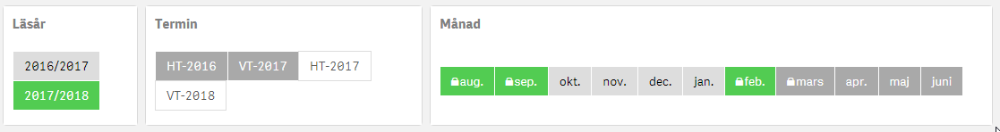

# Simple horizontal list extension for Qlik Sense 

This is a simple extension for making horizontal listbox in Qlik Sense build with AngularJS.
The extension is tested in version April 2018 - November 2018.

### Updates
2020-09-16 - Fix lock icon and possibility to create custom CSS in row level.

Tested in september 2020 version

## Screenshot

